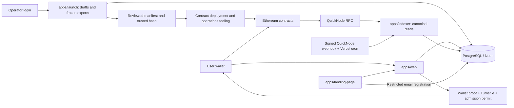
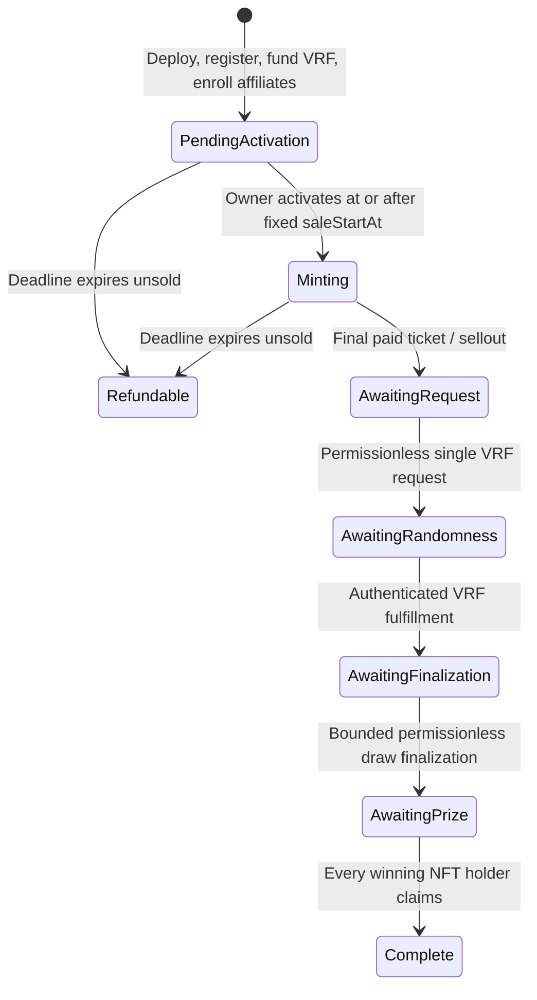

# Tincta protocol architecture and agent handoff

**Architecture reference: 2026-09-22 UTC.** Read this document first when continuing this project. It describes the current source architecture, the decisions that supersede earlier proposals, the recorded staging state, and the work that is still pending. It is internal engineering documentation, not public marketing copy.

Source files are linked throughout. The dated deployment snapshot distinguishes prior staging work from the database/registry setup verified on 2026-09-21. Recheck live state before new transactions or deployment. Older documents remain useful for their named versions but must not override current code or immutable deployed terms.

**V10 integration (2026-09-21):** V10 permanent-number contracts now have local Web/Launch, migration 026, indexer, season-worker and deployment-tooling support. New editable drafts and current preparation/deployment shortcuts target V10; explicit V9 operation and finalized historical exports keep their actual version. Read [permanent-combinations-v10.md](permanent-combinations-v10.md) for API semantics, registry lineage, test evidence and remaining live qualification. **Staging update (2026-09-22 UTC):** migrations 025/026 and Web/Launch/Indexer are deployed; authenticated Launch, historical V8 reads and scheduled indexing were verified. See [the release record](staging-v10-release.md). V10 registries/collections, persistent worker activation and real V10 VRF rehearsal remain pending.

## Contents

- [Protocol in one page](#protocol-in-one-page)
- [Applications and trust boundaries](#applications-and-trust-boundaries)
- [Seasons, collections and identity](#seasons-collections-and-identity)
- [Contract versions and components](#contract-versions-and-components)
- [Collection lifecycle](#collection-lifecycle)
- [Randomness, scores and NFT artwork](#randomness-scores-and-nft-artwork)
- [Economics and affiliate payouts](#economics-and-affiliate-payouts)
- [Affiliate admission and referral links](#affiliate-admission-and-referral-links)
- [Winner credits](#winner-credits)
- [Launch console and season automation](#launch-console-and-season-automation)
- [Database and indexing](#database-and-indexing)
- [Public web behavior](#public-web-behavior)
- [Recorded deployment and verification status](#recorded-deployment-and-verification-status)
- [Known gaps before the next release](#known-gaps-before-the-next-release)
- [Development and next-agent workflow](#development-and-next-agent-workflow)
- [Documentation map](#documentation-map)

## Protocol in one page

The public name is **Tincta**, with the intended domain **tincta.xyz**. Internal package names, Solidity symbols, database prefixes and tooling remain **manekineko**. The visual identity is predominantly white with black type; collection colors and geometric NFT linework provide the color.

A season groups up to ten finite NFT collections. A collection fixes its supply, mint price, names, appearance, prize allocation, affiliate terms and sale schedule before deployment. Historical V9 mints sealed ERC-721 tickets. The local V10 integration mints tickets with permanent, unique four-number identities generated in Solidity. Both use one Chainlink VRF result after sellout to determine distinct winning NFTs and unique scores. In the current default configuration, the six highest-scoring NFTs each receive a 1 ETH prize, **claimed by their holders**. An unsold collection instead lets holders claim their mint-price refunds.

The local integrated launch baseline is **V10**: six equal prizes by default, a qualified equal-share affiliate pool, a lifetime sponsored winner reward, and a cumulative **20 primary mints per recipient wallet per collection**. It inherits V9 economics and separates permanent ticket identity/artwork from draw-dependent scores and prizes. The completed Sepolia rehearsal is **V8**, which did not have that cumulative limit. Eligibility V4 and Winner Credits V5 registries are deployed on Sepolia for V9; V10 requires the new Eligibility V5 and Winner Credits V6 source and a separately verified migration. Neither a V9 nor a V10 factory/collection deployment is recorded; their local support does not change the dated V8 staging evidence.

The latest decisions are:

| Topic | Current rule |
| --- | --- |
| Winners | Configurable 1–10 distinct winning NFTs; default six, equal amounts |
| Prize claim | Only the current holder of that winning NFT can claim; no owner-triggered payout |
| Mint cap | V9/V10: 20 cumulative primary mints per recipient per collection, across all mint paths |
| NFT numbers | V9: score-derived numbers after reveal; V10: permanent token identity numbers from mint, no buyer-supplied numbers |
| V10 metadata | Permanent numbers/code/artwork; scores and prize status read separately from the contract |
| Affiliate eligibility | Hold an eligible NFT from an earlier official completed collection; one initial registry bootstrap exception |
| Affiliate earnings | Qualify through paid referrals, then share equally subject to a common payout cap |
| Referral threshold | New editable defaults and all 216 Mainnet catalog drafts: **1** paid referral; still configurable before deployment |
| Winner reward | At most one sponsored free NFT per wallet lifetime, not one for every win |
| Reward funding | Operator-funded sponsorship pays the full ticket price; recipient pays network gas |
| Next collection | Fixed season delay from confirmed sellout, default one hour; next announcement after 30 minutes |
| Automation | Durable worker, X outbox and Launch controls are implemented; no season worker or live X posting is running |
| Networks | Mainnet catalog planning is separate from fictional Sepolia testing; a network switch does not enable deployment |

One wallet can hold several winning NFTs. A wallet cap is not a per-person limit. These are finite NFT prize collections, not guaranteed-return investments.

## Applications and trust boundaries



| Area | Responsibility | Boundary |
| --- | --- | --- |
| `apps/web` | Seasons, minting, affiliates, claims, NFT gallery, history, public docs and APIs | Wallet signs transactions. Database projections support discovery; verified chain state determines rights and balances. |
| `apps/launch` | Password login, season/configuration editing, estimates, review, immutable exports and automation plans | Saves configuration; does not custody a deployment key or automatically submit blockchain transactions. |
| `apps/indexer` | Confirmed event/state reads, reconciliation, reorg recovery, signed notification ingress | Reads registered contracts; cannot mint, activate, enroll, request randomness or claim prizes. |
| `apps/landing-page` | Independently deployable public landing app; animated seasonal SVGs, all-season planned rewards, color catalog, NFT previews and email registration | Separate from Web and the private console. Planned catalog budgets are 1,296 ETH prizes / up to 292 ETH affiliate pools, not live balances. Email signup uses its own restricted database login and migration 028; see [landing design research](landing-design-research.md). |
| `apps/contracts` | Solidity, deployment/preflight scripts, tests and ABI/source export | Exact version, chain, address and runtime-code checks matter. |
| `packages/contracts` | Package `@manekineko/contract-abi`: versioned ABIs/source, config parsers, shared artwork/economics helpers | Regenerate exports after Solidity changes; never relabel an old deployed contract as current. |

Each of the four Next.js apps has its own Vercel project boundary; the recorded staging rehearsal covers Web, Launch and Indexer, with Landing separate. Contract deployment is separate. A Vercel `production` deployment target can refer to a **staging project**; it does not mean Ethereum Mainnet.

**Git deployment setup (2026-09-22):** the existing Web, Launch and Indexer staging projects are connected to [lucascosta1996/manekineko](https://github.com/lucascosta1996/manekineko), with `main` as their production branch. Normal application releases use pushes to `main`; the app configurations disable automatic deployments from other branches. Environment/protection settings and Indexer schedules remain in Vercel. Database migrations, contracts and season execution remain separate. See [Git deployment workflow](git-deployments.md).

Contract owner, factory owner, eligibility-registry owner, sponsorship-registry owner, admission signer, launch user and database runtime roles are different authorities. An admission signature authorizes enrollment only; it cannot withdraw mint receipts or prizes. The VRF coordinator authenticates entropy. The operator must still fund and advance the required transactions until an executor exists.

## Seasons, collections and identity

### Catalog and stable identifiers

[seasons.json](../seasons.json) is the source of catalog order, themes and exact hex colors. [collection-names.json](../collection-names.json) adds creative collection names for those colors. There are **22 seasons and 216 collections**: 21 seasons of ten and one season of six. Preserve the JSON order, starting with Crimson & Blood Orange; do not alphabetize or add arbitrary color presets.

The catalog is validated by [season-catalog.mjs](../scripts/season-catalog.mjs). Artwork choices depend on stable identity and order. Imported IDs may have been derived using an earlier Sepolia namespace even after their editable plans move to Mainnet. **Keep those IDs**; do not regenerate names, colors, order or motifs merely because a planning network changes. See [season-catalog-order.ts](../apps/launch/lib/season-catalog-order.ts).

| Identifier | Meaning |
| --- | --- |
| Launch plan UUID | Private saved season/automation record |
| `seasonId` | Nonzero bytes32 season identity, shared by its collections; interpret together with chain ID |
| Collection UUID | Backend/public route ID, as in `/mint/<collectionId>` |
| `roundId` | On-chain numeric round within a factory, not globally unique |
| Chain ID + contract address | Deployed collection identity |
| Token ID | NFT within that collection |

A season is a launch/domain grouping, not a separate season NFT contract. Each collection is its own round contract. Current planning/database validation enforces the maximum ten collections and consistent season identity. Do not assume the raw round constructor enforces every catalog or season-planning policy.

### Network workspace

Launch `/seasons` has Mainnet and Sepolia views, with Mainnet selected by default. The 22 catalog plans belong to Mainnet. Fictional tests such as Aster Vale / Cinder Study belong to Sepolia. Existing finalized test configurations are grouped under **Finalized test seasons**, not silently converted into editable new plans.

**Sepolia mock catalog (2026-09-22):** migration 027 and an independent set of 22 Sepolia draft seasons / 216 collections are saved in the verified staging database. Copies retain each source's version, economics, colors, collection order and cadence, with randomly allocated fictional names, symbols, season IDs and collection IDs. This creates new identities; it does not move or relabel the Mainnet catalog or historical deployments. Network authorities, registry/factory addresses, fixed calendar dates, notes and custom social copy are cleared. Private source-revision/order columns support an atomic, idempotent import and stay outside manifests/public payloads. Existing copies are never silently resynchronized or renamed. See [Sepolia mocks](sepolia-mock-seasons.md).

Launch source now exposes Twitter / X settings at the network level even without a saved season. Mainnet and Sepolia use independently encrypted profiles; saving one cannot overwrite the other, and reusing a configured account ID or website across networks is rejected. Sepolia social source uses neutral text/image branding rather than the production wordmark/domain. The updated Launch UI and worker source require deployment; the database copy is already persisted. No real X profile or season execution was created by this change.

`GET /api/launch/automations?chainId=1` or `?chainId=11155111` filters persisted records. A saved plan has one network and every nested collection must agree. Switching the view does not modify a saved plan or broadcast a transaction; unsaved edits must be explicitly discarded before switching.

The separation has two levels in [chain-policy.ts](../apps/launch/lib/chain-policy.ts):

- `requireSeasonPlanningChain` allows supported-network season drafts.
- `requireLaunchChain` enforces `MANEKINEKO_CHAIN_ID` for preparation/export and standalone configurations. It only restricts execution when configured, so deployment environments must set it deliberately.

[Migration 023](../database/migrations/023_season_network_planning.sql) allows Mainnet **draft season plans** in the staging database. It does not permit Mainnet prepared artifacts or Mainnet live collection records there. Do not weaken staging constraints to make a Mainnet preparation succeed.

[organize-season-networks.mjs](../scripts/organize-season-networks.mjs) performed the catalog transition. It defaults to dry run, pins the intended staging database, backs up before `--apply`, uses revision checks, preserves finalized artifacts exactly, and clears old Sepolia deployment addresses/opening dates from moved drafts. Re-running it was verified as a no-op. It is not a general-purpose production migration script.

## Contract versions and components

### Preserved V9 assembly

| Component | Source / marker |
| --- | --- |
| Round | [ManekinekoRoundV9.sol](../apps/contracts/contracts/ManekinekoRoundV9.sol), `affiliate-v9` |
| Factory | [ManekinekoFactoryV9.sol](../apps/contracts/contracts/ManekinekoFactoryV9.sol) |
| Deployment helper | [ManekinekoRoundDeployerV9.sol](../apps/contracts/contracts/ManekinekoRoundDeployerV9.sol), with split code parts to respect deployment-size limits |
| Renderer | [ManekinekoRendererV9.sol](../apps/contracts/contracts/ManekinekoRendererV9.sol) |
| Draw algorithm | [MultiAwardRank.sol](../apps/contracts/contracts/libraries/MultiAwardRank.sol), identifier `unique-rank-v5` |
| Presentation permutation | [ScrambledRank.sol](../apps/contracts/contracts/libraries/ScrambledRank.sol) |
| Affiliate eligibility | [ManekinekoAffiliateEligibilityV4.sol](../apps/contracts/contracts/ManekinekoAffiliateEligibilityV4.sol), `affiliate-eligibility-v4` |
| Winner reward registry | [ManekinekoWinnerCreditsV5.sol](../apps/contracts/contracts/ManekinekoWinnerCreditsV5.sol), `winner-credits-v5` |
| Configuration | [v9-config.ts](../packages/contracts/src/v9-config.ts), requiring `maxMintsPerWallet: "20"` |

The V9 parser removes the fixed mint-cap marker before reusing V8 term validation. The cap is a Solidity constant, not an editable constructor parameter. **Contract V9 and algorithm v5 are different version axes.** Registry versions are independent too.

### Local integrated V10 assembly

| Component | Source / marker |
| --- | --- |
| Round | [ManekinekoRoundV10.sol](../apps/contracts/contracts/ManekinekoRoundV10.sol), `affiliate-v10` |
| Factory | [ManekinekoFactoryV10.sol](../apps/contracts/contracts/ManekinekoFactoryV10.sol) |
| Deployment helper | [ManekinekoRoundDeployerV10.sol](../apps/contracts/contracts/ManekinekoRoundDeployerV10.sol), retaining split creation code |
| Renderer | [ManekinekoRendererV10.sol](../apps/contracts/contracts/ManekinekoRendererV10.sol), permanent JSON and SVG |
| Draw algorithm | Existing [MultiAwardRank.sol](../apps/contracts/contracts/libraries/MultiAwardRank.sol), identifier `unique-rank-v6` for the changed combination-to-score semantics |
| Token identity permutation | [ScrambledRank.sol](../apps/contracts/contracts/libraries/ScrambledRank.sol), encoding `tokenId - 1` with a fixed deployment-derived key |
| Affiliate eligibility | [ManekinekoAffiliateEligibilityV5.sol](../apps/contracts/contracts/ManekinekoAffiliateEligibilityV5.sol), `affiliate-eligibility-v5` |
| Winner reward registry | [ManekinekoWinnerCreditsV6.sol](../apps/contracts/contracts/ManekinekoWinnerCreditsV6.sol), `winner-credits-v6` |

V10 is an additive version, not an upgrade to an existing round. Old deployed V4/V5 registries reject V10 and cannot acquire support from a source-code edit. A future rollout must deploy compatible registries, import eligible history and preserve lifetime reward use, then configure exact version/runtime pins. The local version-aware pipeline now supports both policies, but old prepared V9 artifacts continue as V9. [The V10 handoff](permanent-combinations-v10.md) records completed integration and remaining live rollout.

### Historical semantics

| Version | Why it remains in the repo |
| --- | --- |
| V1 | Original future-block-hash demo and owner-paid single prize; not current production randomness |
| V2–V4 | Earlier VRF, admission and individual-referral-commission designs |
| V5 | Single winner and shared affiliate pool proportional to referrals; old 20-ticket test |
| V6 | Varied combinations, season appearance, NFT-holder eligibility and lifetime winner-credit architecture |
| V7 | Two unequal ranked awards and qualified equal affiliate sharing |
| V8 | Configurable 1–10 equal ranked prizes, default six; completed 1,000-ticket Sepolia test |
| V9 | V8 rules plus cumulative 20 primary mints per recipient wallet; preserved explicit launch/recovery target |
| V10 | V9 rules plus permanent Solidity-generated numbers and artwork from mint; local integrated launch target; live rollout pending |

Historical ABIs, source pages, finalized exports and outcomes keep their actual version. Editing UI defaults cannot upgrade an immutable deployed collection.

## Collection lifecycle



### Deployment, activation and minting

Each round creates and owns its own VRF v2.5 subscription and registers itself as its sole consumer. `fundRandomness()` funds that subscription separately from ticket revenue. Activation requires eligibility registration, the fixed start time and a funded valid subscription. A nonzero subscription balance is a basic gate, **not proof that every future gas/VRF fee is covered**.

Affiliate enrollment closes at `saleStartAt`, even if activation is delayed. The owner calls `activateSale()`; arriving at the countdown's zero does not itself activate anything. Mint calls require an active sale, time before the immutable deadline, available supply and exact payment.

V9 and V10 enforce both a 20-ticket per-call batch limit and a **20-ticket cumulative recipient limit**. `mint`, `mintWithAffiliate` and sponsored winner-credit mints use the same counter. Another payer gifting to an exhausted wallet cannot bypass it. One payer can fund distinct recipient wallets; this is not a payer cap or identity system. V10 does not accept numbers or a combination seed in any mint input; Solidity derives the identity from the assigned token ID.

Allowance is reserved before ERC-721 receiver callbacks. A reverted mint rolls back all effects. Transfers away and refund burns do not restore allowance. Secondary transfers into a wallet are not primary mints. A 1,000-ticket V9/V10 sellout therefore needs at least 50 recipient wallets.

### Sellout, claims and refunds

At sellout, `soldOutAt` is fixed, affiliate entitlements are allocated, and NFT transfers lock until reveal. Anyone can request randomness once and later call bounded finalization. A reverted request can be retried because it created no request; a successful request cannot be rerolled.

`claimPrizeForRank(rank, recipient)` checks `msg.sender == ownerOf(winningTokenIds(rank))`. A collection owner or NFT-approved operator cannot claim for someone else. The holder may choose a different payout recipient; `awardHolder` records the actual winning holder for reward eligibility. `claimPrize(recipient)` is the rank-one convenience alias.

Claims are independent. An unpaid winning NFT remains transfer-locked until its own claim; after payment it transfers as a collectible without an outstanding prize. Losing NFTs unlock at reveal. `prizePaid` and `Complete` mean **all** configured awards were claimed, not merely the first.

`readyForNextRound()` requires sellout, reveal and fully backed remaining liabilities. It does **not** wait for every winner to claim. This lets later collections proceed without confiscating or consuming unclaimed prizes.

If the collection expires unsold, the current token holder calls `refund(tokenId, recipient)` for the mint price and the NFT burns. Refunds are pull payments, not automatic wallet transfers; gas is not refunded. Unsold collections allocate no affiliate earnings or prizes. `cancelExpiredRound()` records cancellation; it is not an arbitrary owner cancellation switch.

**A sold-out V9/V10 collection cannot switch to refunds because VRF is late.** There is no draw-discard timeout escape in these versions. V10's visible numbers are not a completed draw. VRF funding, callback liveness and permissionless finalization still need operational monitoring. Do not copy recovery assumptions from older contract versions.

### Protected money

After reveal, the protected balance equals unpaid prizes + unclaimed affiliate entitlements + remaining growth reserve. Ordinary owner withdrawals can only use surplus above it. Before reveal, mint revenue is not ordinarily withdrawable; the unsold refund branch separately preserves every unrefunded ticket price. Unused VRF funding has its own recovery method after entropy arrives or an unsold sale expires.

The growth reserve has a separate owner-only withdrawal after reveal and a separate event. Its accounting separation does **not** enforce a future governance program or guarantee what the owner spends it on.

## Randomness, scores and NFT artwork

One VRF word per collection feeds a domain-separated deterministic hash stream. The coordinator-authenticated callback stores entropy only: it does not loop over NFTs, pay holders or perform the draw. Zero is a valid random word.

`finalizeDraw(attempts)` accepts 1–8 attempts and advances a persistent cursor. Rejection sampling maps a candidate into the ordered sampling space `N × (N−1) × … × (N−K+1)`. Mixed-radix selection chooses distinct token IDs without replacement. Callers cannot choose different entropy or reset the cursor by varying timestamps or batch size.

The winning scores are `N, N−1, …, N−K+1`; losing token IDs receive the remaining unique scores in token order. Thus there is exactly one greatest score and no prize-rank ties. **This is a random selection of winning ranks, not a uniformly random shuffle of every losing score.** Fairness relies on the VRF and hash assumptions. With 1,000 tickets and six awards, each ticket has a 6/1,000 chance of any award under those assumptions; that says nothing about resale value or expected profit.

For V6–V9, the reversible presentation permutation turns the score into varied four-number combinations after reveal. The on-chain `scoreCombination` reverses that score encoding. Preserve this historical behavior and do not reintroduce the old low-rank `1 / 1 / 1 / n` presentation.

For V10, the permutation instead encodes `tokenId - 1` with a fixed deployment-derived `combinationKey`. Each of the four ordered numbers is 1–16, covering 65,536 identities without collisions within one collection. The key and every potential identity are public and predictable; neither is prize entropy. `combination(tokenId)` works from mint and returns score zero while the draw is unfinished. `score(tokenId)` and `scoreCombination(numbers)` require finalization; the latter decodes the identity, checks that its NFT exists, then returns the VRF-derived score. No number, seed or VRF input comes from mint callers. The winner algorithm still selects exactly the configured 1–10 distinct NFTs (default six), not necessarily that many wallets.

SVG artwork and JSON metadata are generated on chain by the renderer and returned through `tokenURI`. The season name and collection name appear on the NFT, together with its color, linework and numbers. V8/V9 add the draw outcome after reveal. V10 deliberately omits score, prize, award rank and changing lifecycle status from both JSON and SVG, so a minted NFT has the same `tokenURI` through sellout, VRF, finalization, claims, transfers and unsold cancellation. A refund burns the NFT, after which `tokenURI` reverts. Draw results and claim state remain separate contract reads. [tincta-artwork.ts](../packages/contracts/src/tincta-artwork.ts) and [tincta-motifs.ts](../packages/contracts/src/tincta-motifs.ts) support versioned previews, including permanent V10 identity artwork. Predeployment V10 samples are illustrative because the eventual collection address/key is unknown.

[season-appearance.ts](../packages/contracts/src/season-appearance.ts) normalizes `#RRGGBB` and chooses black or white by contrast before deployment. That reviewed choice is stored on chain; later display does not depend on a frontend contrast calculation. Names must be escaped/validated in both SVG and metadata.

No IPFS or image server is required to construct the NFT. The broader system still uses off-chain VRF infrastructure, RPC, database indexing, abuse checks and hosting. Do not claim the entire protocol has no off-chain dependencies. External explorers can cache stale metadata or decline to render a data-URI SVG; verify rendering separately from valid on-chain metadata. The app's NFT detail page is the first-party inspection path, with appropriate external links.

V8 and V9 advertise ERC-4906 and emit `BatchMetadataUpdate(1, totalMinted)` when finalization sets `revealed`. Metadata changes at reveal, before prize claims; it remains revealed after every claim. Local [metadata lifecycle regressions](../apps/contracts/test/NftMetadataLifecycle.ts) cover both versions, winning and losing artwork, number/score traits and the update event. This cannot force an external explorer to refetch. On 2026-09-21, completed V8 token #81 had a stale Blockscout cache; its requested refresh was later verified matching the chain. A [durable Indexer refresh queue](nft-metadata-refresh.md) now exists in source with migration 025, a separate minute cron, canonical reads, full JSON comparison, persisted retries and provider-wide rate limits. The user explicitly requested keeping this change local; staging migration, grants and deployment are deferred. V9 retains the external cache risk; recovery is independent of draw settlement and prize delivery and cannot guarantee immediate explorer updates.

V10 retains the ERC-4906 interface for compatibility but has no draw/cancellation metadata transition to announce. Permanent initial metadata removes the stale-Sealed transition; it does not guarantee an explorer's first indexing time or SVG support. The refresh queue explicitly excludes V10 from discovery, claiming and processing; its Score/revealed-metadata decoder is only for historical versions. The old queue remains relevant to V8/V9 and remains local at the user's request.

## Economics and affiliate payouts

These are **internal planning examples**, not fixed ETH promises independent of a collection's terms. Public copy should emphasize prize amounts, eligibility, dates and claims rather than prominently marketing gross collection receipts or operator income. Keep verification information accurate and accessible.

### New editable defaults

The authoritative defaults are in [form-values.ts](../apps/launch/components/launch/form-values.ts).

| Setting | Default |
| --- | --- |
| Supply / mint price | 1,000 / 0.01 ETH |
| Prize allocation / winners | 60% / 6 equal awards |
| Affiliate pool | 20% for Growth; 10% for the Standard preset |
| Affiliate positions | 10, configurable 1–100 |
| Paid referrals to qualify | 1; configurable before deployment |
| Common payout cap | 30% of the lowest qualifying affiliate's referred revenue |
| Wallet primary mint limit | Fixed 20 in V9/V10 |
| Sale duration | 30 days unless changed in the draft |
| Planned enrollment window | 900 seconds |
| VRF confirmations / callback gas | 64 / 200,000; validate against intended coordinator and funding before release |
| Next launch / announcement delay | 3,600 / 1,800 seconds from predecessor sellout |

At these price/supply settings, sellout receives 10 ETH: 6 ETH is reserved for prizes, the Growth affiliate budget is 2 ETH, and the ordinary operator allocation is 2 ETH before costs. Standard reserves 1 ETH for affiliates and leaves a 3 ETH ordinary operator allocation. Gas, VRF, sponsorship, services and other expenses reduce economic net income. Growth reserve is tracked separately from that ordinary operator allocation.

Changing price, supply, prize percentage or winner count changes the award amount. `prizeBps` must be positive and divide exactly by `winnerCount`; prize and affiliate allocations must fit within 10,000 basis points. Wei amounts use integers/BigInt and decimal strings, never floating-point money.

### Qualified equal-share formula

For immutable collection terms, let:

- `R` be actual total mint revenue, including fully paid sponsored mints.
- `P = R × affiliatePoolBps / 10000` be the affiliate pool.
- `Q` be the number of enrolled affiliates with at least `minAffiliateReferrals` attributed paid tickets.
- `L` be the smallest paid referred-ticket count among those qualifiers.
- `M` be the ticket mint price and `C` the payout-cap basis points.

At sellout:

```text
if Q = 0:
  payout per affiliate = 0
else:
  payout per qualifying affiliate = min(floor(P / Q), floor(L × M × C / 10000))

total affiliate entitlement = Q × payout per qualifying affiliate
growth reserve = P − total affiliate entitlement
```

The contract's price divisibility rules support exact basis-point allocations; division remainders remain in the growth reserve. Organic sales fund the pool too. Sponsored winner-credit mints fund the full price but do not create attributed paid referrals.

Every qualifier receives the same payout, capped using the **lowest qualifier's referral revenue**. This is neither a direct per-referral commission nor the old V5 proportional pool. One low-volume qualifier can reduce the common payout. Empty positions and unqualified affiliates receive nothing; they are not counted in `Q`.

| Growth example: 2 ETH pool, 0.01 ETH ticket, 30% cap | Each qualifier | Total entitlement | Growth reserve |
| --- | ---: | ---: | ---: |
| 4 qualifiers, 1 referral each | 0.003 ETH | 0.012 ETH | 1.988 ETH |
| 8 qualifiers, 1 referral each | 0.003 ETH | 0.024 ETH | 1.976 ETH |
| 10 qualifiers, 1 referral each | 0.003 ETH | 0.030 ETH | 1.970 ETH |
| 4 qualifiers, at least 167 referrals each | 0.500 ETH | 2.000 ETH | 0 ETH |

Changing **positions** does not increase the pool. The launch example now assumes every offered position qualifies at the configured minimum, so its total distribution responds to that input. Its per-affiliate amount can remain unchanged when the cap is binding. The display is hypothetical; actual qualification comes from chain referral counts.

Affiliates withdraw their own accrued balance using `claimAffiliateCommission(recipient)`. It is available at irrevocable sellout without waiting for prize claims. History's **Affiliates paid** is the sum of confirmed `AffiliateCommissionClaimed` events, not the pool budget, an estimate or an unclaimed entitlement. Separate network/currency totals.

## Affiliate admission and referral links

### Enrollment flow

1. The connected wallet selects an available collection position and, where required, an eligible NFT it currently owns.
2. Web issues a short-lived authentication challenge bound to wallet, collection, website origin and offered terms. The wallet signs it; the user completes Turnstile.
3. The backend verifies the wallet proof, Turnstile result, trusted network input, replay/rate limits and chain eligibility. It issues a short-lived EIP-712 enrollment permit.
4. The **applicant wallet** submits `enrollAffiliate`. The registry verifies the permit, eligibility, nonce and exact target binding; the round records the position.
5. The UI reads the confirmed position and offers its referral URL. A permit by itself is not completed enrollment.

Sources: [service.ts](../apps/web/lib/affiliates/service.ts), [policy.ts](../apps/web/lib/affiliates/policy.ts), [enrollment.ts](../apps/web/lib/affiliates/enrollment.ts), and the eligibility registry.

The current permit binds `applicant`, `affiliateId`, `poolBps`, `sourceCollection`, `sourceTokenId`, `nonce` and `deadline`, with EIP-712 chain/target-contract domain separation. Positions cannot be duplicated, signatures cannot be reused across rounds or chains, and source eligibility is checked on chain at enrollment. An expired or raced slot requires a fresh offer, not silent reassignment.

Abuse checks use Vercel's trusted proxy header, per-collection HMAC IP digests, bounded requests, database challenge/rate-limit state and a Turnstile response bound to the expected hostname/action/challenge. IP addresses are an abuse signal, not proof of unique humanity. Do not trust arbitrary client-supplied IP headers or remove these checks to make local enrollment work.

### NFT-holder rule and bootstrap

The source must be an earlier official registered collection that satisfies the registry's completion rule. For V7–V10 this uses verified draw/fully backed liabilities via `readyForNextRound`, not necessarily every prize already claimed. A still-owned source NFT can authorize only one affiliate enrollment **per target collection**. Passing it between wallets does not reuse it for multiple positions in that target. Subsequent transfer does not revoke an already enrolled affiliate's commission rights.

There is an exemption for sequence 1 in the canonical eligibility registry. It is not intended as a fresh exemption for every season, factory or registry upgrade. Preserve/import eligible history before registering new collections. Current-collection ownership is not the rule: affiliate enrollment ends before its mint opens.

**V9 migration update (2026-09-21):** Eligibility V4 permits a completed V8 collection bound to its historical registry to register as a source-only import. Local Solidity regressions verify that it cannot become a new enrollment target or create another bootstrap. The Sepolia V4/V5 registries are now deployed, with the completed V8 source imported and old lifetime usage preserved. The old registry's unused 0.06 ETH sponsorship was returned to the operator before migration. See the [executed setup record](sepolia-v9-registry-setup.md) for verified addresses, hashes, receipts and the requirement to keep old sponsorship targets unfunded.

### What the URL proves

The current URL shape from [account.ts](../apps/web/lib/affiliates/account.ts) is:

```text
/mint/<collectionUUID>?affiliate=<positionId>&collection=<contractAddress>
```

The URL itself is public and **not a secret or signed credential**. The app validates the collection binding and enrolled affiliate, and the signed mint transaction calls `mintWithAffiliate(to, quantity, affiliateId)`. The contract recognizes only a valid enrolled position and prevents a payer or recipient from referring their own wallet. Editing a URL cannot increase the pool or redirect another position's stored beneficiary, but referral attribution remains the buyer's explicit transaction input; it is not unchangeable proof of who first advertised the collection.

Balance/status reads and commission withdrawals do not require enrollment secrets or a valid sharing origin. “Affiliate enrollment is not configured yet” means admission configuration is unavailable, not that an existing commission disappeared. “Refresh balances” reads state; it does not claim money or send a transaction. Account selectors can show only accounts the wallet has authorized for the current site. Clear stale wallet state on account/network changes and recheck the actual signer before sending.

## Winner credits

The final reward policy is **one redeemed free NFT per wallet lifetime** across the official supported registry lineage. Winning again does not renew it. It is not one free mint in every collection or one redeemable credit per win.

For ranked awards the beneficiary is the holder recorded when that prize was claimed, not the chosen payout address or a later secondary buyer. Eligible source award settlement is checked. Several award records may exist for a wallet, but `lifetimeRewardUsed` prevents more than one redemption.

The destination must be a later participating registered collection, with an active sale, remaining supply, enough sponsor balance and remaining V9/V10 mint allowance where applicable. The operator sponsors that target registry balance separately; redemption calls the ordinary full-price mint for one ticket. It contributes the same prize/affiliate/refund funding as any full-price ticket but earns no paid referral credit. Failed redemption rolls back both credit use and funding. If that target later expires unsold, the NFT holder can claim its funded mint-price refund and the lifetime reward stays spent.

Winner Credits V5 reads the prior registry's lifetime-use state. Older registries cannot see future redemptions in a new registry. Before enabling new funding, retire all old mintable destinations and remove old sponsorship according to the reviewed migration procedure; zero balance is insufficient because a registry can be funded again. Keep old registry governance retired so it cannot register new mintable destinations; otherwise parallel old/new registries can undermine the lifetime limit. See [winner-credits.md](winner-credits.md) and [winner-credit-operations.mjs](../scripts/winner-credit-operations.mjs), but use V5-specific source and pins for V9.

V10's Winner Credits V6 extends version support while preserving this lifetime policy and previous-registry checks. Local Web, worker and setup tooling now support it; its deployment and live historical-source migration are pending. Existing V5 deployments remain V5 and reject V10 destinations; do not repoint Web or fund V6 destinations before the lineage and retirement checks in the [V10 handoff](permanent-combinations-v10.md) are complete.

## Launch console and season automation

### Saved plans versus execution

Launch authentication is separate from wallet connection. Sessions, accounts and throttling are stored in PostgreSQL. Mutating APIs check an active actor, origin, bounded JSON, payload validation and revision conflicts. Saved drafts are editable. Finalization/preparation creates a reviewed snapshot plus content hash; later edits cannot rewrite a finalized artifact in place.

Primary implementation:

- [launch-config.ts](../apps/launch/lib/launch-config.ts), [launch-config-validation.ts](../apps/launch/lib/launch-config-validation.ts), [launch-config-store.ts](../apps/launch/lib/launch-config-store.ts)
- [launch-automation.ts](../apps/launch/lib/launch-automation.ts), [launch-automation-validation.ts](../apps/launch/lib/launch-automation-validation.ts), [launch-automation-store.ts](../apps/launch/lib/launch-automation-store.ts)
- [automation-console.tsx](../apps/launch/components/automations/automation-console.tsx)
- [launch-auth.ts](../apps/launch/lib/launch-auth.ts) and [launch-auth-policy.ts](../apps/launch/lib/launch-auth-policy.ts)

`npm run launch:prepare:current` requires a V10 manifest and an independently trusted expected hash. It emits deployment inputs without broadcasting. The launch app does not gain transaction authority by saving or preparing a season.

New editable defaults and generic deployment shortcuts now select V10. Explicit V9 preparation/deployment and worker recovery remain versioned. Finalized artifacts are never rewritten; saved V9 drafts retain their version until a deliberate revisioned edit. V10 metadata previews show identity rather than winner status, and estimates use V10 artifacts.

### Fixed schedule

The first opening is an explicit UTC time. For later collections, [season-timeline.ts](../apps/launch/lib/season-timeline.ts) computes:

```text
nextAnnouncementAt = previous confirmed soldOutAt + nextAnnouncementDelaySeconds
nextLaunchAt       = previous confirmed soldOutAt + nextLaunchDelaySeconds
```

Defaults are 30 minutes and one hour respectively. The next opening is fixed, not measured from when a worker happens to wake up or when the last prize claimant returns.

The intended sequence is a sellout statistics post, a separate winners post **after verified draw**, then a next-opening announcement at the configured offset. Winner identities cannot be truthfully announced at sellout before VRF arrives. Default templates do not advertise operator receipts; the template engine still has internal economic fields, so review public message content deliberately.

The resolver requires matching network/version/factory settings, canonical predecessor evidence, verified draw, fully reserved prizes, enough time for deployment/enrollment, and valid immutable deadlines. Unsold/failed predecessors pause for review. It does not automatically roll forward a refunded collection. A missed fixed opening pauses rather than silently changing the advertised time. Activation planning allows a 60-second execution lag only with readiness already confirmed by the opening time and required announcements confirmed when social posting is enabled.

[Migration 020](../database/migrations/020_season_launch_planning.sql) retains planning data. [Migration 024](../database/migrations/024_season_automation_runtime.sql) adds encrypted per-network X profiles, immutable run bindings, a private transaction/social outbox, activity logs and a separate whitelisted public schedule. The external worker has separate chain-pinned `scripts/season-runner/mainnet.ts` and `sepolia.ts` entry points (`season:run:mainnet` / `season:run:sepolia`); the legacy `cli.ts` only dispatches to them. Its shared lifecycle owns a direct PostgreSQL network lock, signs locally, persists encrypted journals before broadcast, reconciles receipts and advances exact V9 or V10 collections based on the prepared artifact. Migration 026 extends immutable runtime binding to homogeneous V10 plans without changing old plans. X delivery is checked against the configured numeric account ID; uncertain create-post responses pause for explicit reconciliation. Public countdowns appear after the first confirmed announcement; zero does not guarantee activation.

The Sepolia rehearsal creates and reuses an encrypted 50-wallet vault, checks cumulative V9/V10 mint counts and available balances, and can reclaim owned test prizes/refunds and released operator funds. These capabilities are forbidden on Mainnet: its entry point never loads the rehearsal adapter, rejects simulation flags before environment/service access, and the runner rejects persisted rehearsal state before replay. Mainnet uses the configured operator for lifecycle operations and waits for real buyers. Sepolia simulation remains explicit with `--sepolia-rehearsal` and wallet creation requires `--execute`. Read [season-automation.md](season-automation.md), [season-social-automation.md](season-social-automation.md) and the worker source before execution. Local implementation/tests are not evidence of a hosted worker, live V10 migration or successful X delivery. Do not schedule a Codex task as a substitute for the protocol worker.

## Database and indexing

### Data responsibilities

PostgreSQL/Neon stores plans, admission state and queryable chain projections. The database does not decide a winning token or authorize an otherwise invalid chain withdrawal.

| Tables (prefix `manekineko_`) | Purpose |
| --- | --- |
| `networks`, `series`, `collections`, `deployments` | Registered identities, immutable terms and contract deployment provenance |
| `collection_state` | Verified current lifecycle snapshot |
| `collection_history`, `history_winners`, `collection_awards` | Outcomes, legacy winner compatibility and per-rank awards |
| `affiliate_programs`, `affiliate_challenges`, `affiliate_rate_limits` | Program configuration and admission bookkeeping; accrued/claimed rights still come from chain |
| `launch_users`, `launch_sessions`, `launch_login_limits` | Private console authentication |
| `launch_configurations`, `launch_configuration_events` | Standalone drafts, final artifacts, revisions and audit trail |
| `launch_automations`, `launch_automation_events` | Named season plans with per-collection settings and audit trail |
| `season_runtime_profiles`, `season_runtime_runs`, `season_runtime_actions`, `season_runtime_events` | Private encrypted X configuration, immutable run bindings, journals/outbox and runtime activity |
| `season_runtime_public` | Whitelisted announced schedule, the only runtime table readable by Web |
| `season_launch_schedule`, `season_action_intents` | Future execution schedule and action intent records |
| `indexer_checkpoints`, `chain_events`, `indexer_webhook_deliveries` | Canonical progress, deduplicated events, leases and notification replay protection |

Migrations [018](../database/migrations/018_collection_seasons.sql), [019](../database/migrations/019_multi_awards_v7.sql), [020](../database/migrations/020_season_launch_planning.sql), [021](../database/migrations/021_equal_awards_v8.sql), [022](../database/migrations/022_wallet_mint_cap_v9.sql) and [023](../database/migrations/023_season_network_planning.sql) layer appearance, multi-awards, timing, equal prizes, wallet caps and network planning onto the older schema. Migration [026](../database/migrations/026_permanent_combinations_v10.sql) adds exact V10/`unique-rank-v6` constraints, preserved financial invariants and prepared V9/V10 runtime binding. Apply the full ordered migration history, not only the last file. Historical rows keep version-specific nullable fields and invariants.

Use separate restricted Web, Launch and Indexer database credentials and an administrative migration connection. Do not use the admin connection as an app runtime credential. Public queries require deployed, verified live records; fixture/demo tables are not a fallback when a live read fails.

### External mint to visible UI

1. A wallet mints through Web, Etherscan or another client against the same round.
2. QuickNode's signed webhook hints that work may exist; a minute Vercel cron is the independent recovery path.
3. Indexer queries the pinned RPC, checks chain/factory/runtime trust, reads canonical logs/state at the confirmation threshold and applies a bounded transaction.
4. Unique event keys prevent double counting; checkpoints/leases manage progress. Reorg handling rebuilds affected projections rather than trusting stale notifications.
5. Web refreshes database-backed collection/history/gallery state. No browser “mint success” callback is required to make an externally submitted mint visible.

Endpoints are `/api/indexer/run`, `/api/indexer/quicknode` and `/api/indexer/status`. Cron and webhook use separate authentication. A notification is not an authoritative count or permission to register an arbitrary address. See [config.ts](../apps/indexer/lib/config.ts), [chain.ts](../apps/indexer/lib/chain.ts), [store.ts](../apps/indexer/lib/store.ts) and [automatic-indexing.md](automatic-indexing.md).

Current indexer source accepts V5–V10. The legacy configuration chooses one `INDEXER_CONTRACT_VERSION` and its independently trusted factory/runtime hash. `INDEXER_TRUSTED_FACTORIES_JSON` supports up to eight exact version/factory/hash profiles on one chain, each with a separate cycle. The season worker indexes the verified factory selected by its prepared artifact. V10 pins are `INDEXER_V10_TRUSTED_FACTORY` and `INDEXER_V10_TRUSTED_FACTORY_CODEHASH`; V9 and V8 retain their own pins. Hosted configuration and provider filters must be updated separately.

The V10 reader verifies the deployment-derived permanent key, decodes award numbers into token identity, and checks final scores/ranks separately from identity. Its immutable pair is `affiliate-v10` / `unique-rank-v6`; V8/V9 remain `unique-rank-v5`. Canonicality, lease, transaction and reorganization guarantees remain shared, including atomic removal of orphaned award/claim projections. Per-token numbers are read canonically by Web before reveal; visible numbers never imply a settled score. Historical refresh queue discovery/processing explicitly excludes V10.

## Public web behavior

Public Web readers and transactions now support V10 locally: mint/detail/gallery/history, contract-source pages, scoring verification, affiliate admission and winner credits use exact versioned ABIs/pins. V10 numbers and artwork appear from mint; pending score is `null`. After finalization, direct strict score reads and identity decoding verify results separately from the permanent image. The metadata validator rejects mutable score/status/award/prize fields. Existing V8/V9 NFTs retain their actual sealed/revealed behavior. Local integration is not hosted or connected-wallet proof.

| Route | Intended behavior |
| --- | --- |
| `/seasons` | Deployed seasons plus color-only upcoming teasers; complete season palettes under cards |
| `/seasons/<chainId>/<seasonId>` | Season collections and current live collection emphasis |
| `/mint` | Redirect to the current live season and collection anchor, otherwise `/seasons` |
| `/mint/<collectionId>` | Permanent V10 preview or historical sealed/revealed preview, exact mint terms, cap allowance, deadline and holder prize/refund actions |
| `/mint/<collectionId>/affiliates` | Enrollment eligibility, account selection, referral link, qualification and claimable/paid balances |
| `/mint/<collectionId>/contract` | That collection's actual versioned source and Etherscan contract link |
| `/my-nfts` | Wallet NFT discovery with ongoing/completed status and ownership information |
| `/nfts/<collectionId>/<tokenId>` | NFT SVG, generated numbers, score/outcome and chain-appropriate external links |
| `/history` | Confirmed results, multiple awards and affiliates actually paid; in-progress records distinguished |
| `/docs` | Reader-facing V10 architecture, explicit historical-version behavior and integration/deployment boundary; distinct from this engineering guide |

Sources include [seasons/model.ts](../apps/web/lib/seasons/model.ts), [seasons/activity.ts](../apps/web/lib/seasons/activity.ts), [nfts](../apps/web/lib/nfts), [affiliates](../apps/web/lib/affiliates), and [ranked-awards.tsx](../apps/web/components/prizes/ranked-awards.tsx).

Do not expose unpublished names via teaser text, SVG, alt text or public payloads merely to display colors. Do not fabricate opening times from a draft or show “mint open” just because a counter reached zero. Expiry, pending activation, awaiting randomness, unclaimed prizes and unavailable reads are different states. Never render a failed balance read as a confirmed zero.

External links depend on the network. Etherscan contract source links are useful even if its NFT image viewer has not refreshed. NFT metadata comes from the contract; third-party image indexing is a separate acceptance check. The site has a compact navbar and collapsible mobile menu; preserve the shared Tincta identity when adding screens.

## Recorded deployment and verification status

**Historical snapshot from 2026-09-21 for the verified database, registry and Launch setup. The [2026-09-22 application release](staging-v10-release.md) supersedes the database and hosted application rows below. Existing collection results below remain dated V8 rehearsal evidence. Reverify before new execution.**

| Surface | Recorded state |
| --- | --- |
| [Staging Web](https://manekineko-staging-web.vercel.app) | New registry pins deployed; hosted V5 credit reads preserve both V8 winner wallets' single lifetime rewards; announced-season API is empty |
| [Staging Launch](https://manekineko-staging-launch.vercel.app) | V9 runtime controls deployed; authenticated read verified encryption ready, X profile absent and no run |
| [Staging Indexer](https://manekineko-staging-indexer.vercel.app) | Existing V8 deployment/pins; source supports V9 but its live rollout is pending |
| Staging database | Migrations through 024; restricted runtime grants verified; 22 Mainnet draft seasons / 216 collections and finalized test artifacts preserved; no X profiles or runs |
| Sepolia registries | Eligibility V4 and Winner Credits V5 deployed; completed V8 source imported; previous winner-credit history retained; [verified pins](sepolia-v9-registry-setup.md) |
| Preserved V9 pipeline | Explicit V9 source/tooling remains available; no V9 factory/collection deployment recorded |
| Local integrated launch source | V10 permanent combinations, Eligibility V5 and Winner Credits V6, migration 026, Web/Launch/indexer/worker and deployment tooling; no live V10 rollout; see [handoff](permanent-combinations-v10.md) |
| Mainnet | Planning only; no deployment/audit qualification established |

The completed fictional V8 test is **Aster Vale / Cinder Study**, collection UUID `c8c1cea8-5db9-4206-a64b-4bc3ec025853`, [Sepolia contract `0xf564cc9cA88A036211dC37cBDc4F116f18a22cb2`](https://sepolia.etherscan.io/address/0xf564cc9cA88A036211dC37cBDc4F116f18a22cb2#code). It sold 1,000 tickets, paid six 1 ETH prizes and 2 Sepolia ETH in affiliate withdrawals. Its two buyer wallets each minted 500 using repeated batches. That prompted V9; the existing V8 cannot gain the new cap. Its original referral qualification minimum remains 100, not the current editable default of one.

The earlier V8 collection UUID `e30303a5-7b3f-46f0-8b88-258bc1a74f0a` was superseded for the accelerated rehearsal and recorded as unactivated with zero mints. It may still be visible as historical/in-progress data. Do not silently delete or relabel it to make the new plan look cleaner.

The historical 20-ticket V5 test used UUID `3342c115-3d41-4cb4-be45-fa103178f0ff` and [contract `0xAfFd7dc1B6A0D8974040F3216316240B724715A9`](https://sepolia.etherscan.io/address/0xAfFd7dc1B6A0D8974040F3216316240B724715A9#code). It is not the current rehearsal, and removed mock/legacy database entries must not be restored just because an older guide mentions them.

Sepolia names should remain fictional. Mainnet branding should not be copied into new test metadata without an explicit reason; fictional labels do not guarantee anonymity of public wallet/funding activity.

### Evidence boundaries

The 2026-09-21 setup separately verified migration 024 and actual restricted database connections, seven canonical Sepolia transactions (unused sponsorship recovery plus six registry operations), authenticated hosted Launch encryption readiness, and hosted Web reads for both historical winner wallets. Both Web and Launch deployment builds passed. No X credentials were supplied, no season run was created, and no connected-wallet V9 mint/redemption or live X delivery was tested. See [the setup record](sepolia-v9-registry-setup.md).

Local logs from the preceding work include:

- `.vercel/wallet-cap-v9/contracts-all.log`: 362 contract tests passed at that run; V9 cap, callback, transfer/refund, sponsorship and full 50-recipient sellout cases are represented in the test suite.
- `.vercel/wallet-cap-v9/contract-v9-tests.log`: seven focused V9 configuration tests passed.
- `.vercel/wallet-cap-v9/web-tests.log`: 239 passed, two skipped.
- `.vercel/wallet-cap-v9/indexer-tests.log`: 47 passed, six skipped; skipped database cases are not live-service proof.
- `.vercel/season-networks/launch-tests.log`: 145 passed, four skipped; launch typecheck and isolated database migration/planning checks also passed.
- `.vercel/season-networks/database-test.log`: network draft/preparation boundaries and persistence checks on an isolated database.

The preceding session verified the authenticated season UI, the 22 Mainnet plans, the Sepolia finalized group and the example changing with the position count. A separate direct HTTP login/save smoke attempt returned 401 before writing; do not report that particular remote write test as passed. Database updates were applied through the reviewed administrative script and verified separately. Existing browser authentication is not proof that a stored login credential remains valid.

These are dated implementation and staging evidence, not fresh V10 test results, a V9/V10 production rehearsal or an independent audit. V10 verification is recorded separately in its [handoff](permanent-combinations-v10.md). Private `.vercel` journals may contain sensitive operational data: inspect only the required nonsecret fields and never publish their contents wholesale.

### Local V10 runtime verification (2026-09-21)

The completed local integration passed **386 Solidity tests**, **263 Web tests**, **185 Launch tests**, **78 Indexer tests** and **68 season-worker tests**. The application and worker suites included their isolated database opt-ins with no skips. Operations/preparation/staging/retirement checks passed **95 tests**, including enabled historical eligibility database checks. Web/Launch/indexer builds and typechecks, contracts build/typecheck and season typecheck passed.

At the time of that local verification, migration 026 was applied only in a disposable local PostgreSQL 16 environment; the later staging migration is recorded separately above. Its verifier proved unchanged V8/V9 finalized exports, hashes and catalog plans, strict V10 terms, homogeneous version-bound runtime runs, preserved staging Mainnet restrictions, and immutable award/admission behavior. Shared V10 identity helpers and preview SVG were compared with Solidity output for token IDs 1, 7 and 20; byte-exact parity tests passed. See the [detailed verification boundary](permanent-combinations-v10.md#verification-boundary). These checks do not establish live migration/grants, hosted V10 operation, connected-wallet flows, real VRF/X or external explorer rendering.

## Known gaps before the next release

**V10 application support and migrations through 026 are deployed to staging; V10 on-chain qualification remains pending.** See [the integration and qualification checklist](permanent-combinations-v10.md#integration-status-and-remaining-checklist). Current tests do not authorize a live migration or deployment.

1. **Persistent worker:** staging migrations through 026, restricted grants and Web/Launch/Indexer deployment are complete; see [the release record](staging-v10-release.md). Configure and qualify the persistent season worker separately.
2. **V10 registry lineage:** deploy Eligibility V5 / Winner Credits V6 with exact runtime pins and reviewed historical sources, preserve the legacy root and previous lifetime-use state, and retire old mintable reward destinations. Zero sponsor balance alone is insufficient; old registry governance must not later register/fund new destinations. Existing V4/V5 Sepolia pins remain historical V9 evidence.
3. **V10 deployment and indexing:** prepare a fresh V10 export, verify components/constructor/runtime/source and canonical registration/funding. Configure independent historical and V10 factory pins, hosted cron and provider filters; do not abandon older claims or relabel a V8/V9 export.
4. **Full Sepolia rehearsal:** use at least 50 recipients for 1,000 primary mints. Verify first-mint external artwork, byte-identical metadata after real VRF/claims, the 21st recipient-mint rejection across mint paths, six holder claims, affiliates, lifetime credits, mixed-version indexing and a separate unsold refund.
5. **Authenticated/connected-wallet and X checks:** distinguish historical hosted read checks from new V10 runtime acceptance. Configure the X test account, verify encrypted persistence and numeric identity, then exercise real worker transactions, public counters and posts within the reviewed spending budget.
6. **Mainnet qualification:** separate environment, registry lineage/bootstrap, custody/funding, monitoring/recovery, external explorer checks, end-to-end acceptance and independent contract/security review. Staging allows Mainnet draft planning only.


## Development and next-agent workflow

### Environment and commands

Use the versions pinned by `.nvmrc`, lockfile, [package.json](../package.json) and [contracts package](../apps/contracts/package.json), rather than upgrading packages while making an unrelated change. Current runtime is Node 22.20.0; Solidity is pinned to 0.8.37 with Cancun target. Verify the installed/compiler settings when changing contracts.

```sh
nvm use
npm ci
npm run dev             # Web 3100 + Landing 3101 only
npm run dev:launch      # Launch 3200, separate terminal
npm run dev:indexer     # Indexer 3300, separate terminal

npm run contracts:test
npm run web:test
npm run launch:test
npm run indexer:test
npm run credits:test
npm run eligibility:test
npm run contracts:export
npm run typecheck
npm run build
```

Run checks relevant to the change; database tests that opt out require a separate isolated-database verification. Contract exports include size checks and generated shared artifacts. For V10 preparation and read-only Sepolia preflight after setting the reviewed environment:

```sh
npm run launch:prepare:current -- --manifest /absolute/path/export.json --expected-hash TRUSTED_HASH --output /absolute/path/new-directory
npm run v10:preflight:sepolia --workspace @manekineko/contracts
```

Preparation is not broadcast. [deploy-v10.ts](../apps/contracts/scripts/deploy-v10.ts) has its own explicit environment, broadcast controls and transaction journal. Read it and the finalized deployment plan before execution. Explicit V9 commands remain available for historical exports and recovery; generic current shortcuts now target V10.

The user subsequently authorized the staging application release on 2026-09-22 UTC. Migrations and hosted app deployment are recorded in [the release record](staging-v10-release.md); V10 registry/contract setup and season execution remain separate pending operations. Version-aware preparation verifies the selected contract/algorithm/renderer and registries; it never upgrades an old frozen artifact.

Default ports are defined in app package scripts; a previously opened browser on a temporary port is not a configuration source. On `EADDRINUSE` or a Next lock, inspect listeners and their working directories, then reuse or stop only the matching app. Do not delete a lock while its server is running. `EPERM` can indicate tool/sandbox permissions rather than broken application code.

The local Web environment may point to the same restricted staging database as hosted Web. `db:seed`/`db:setup` load fixtures and must only be used against a deliberately isolated development database. For schema tests, use the existing isolated verification scripts and inspect their target guards first.

Private setup lives in ignored environment files such as `.env.staging.local`, `.env.staging.wallets.local` and app-specific exports. Document variable names and roles, never values. Do not print RPC URLs with embedded credentials, private keys, session secrets, Turnstile secrets or entire `.vercel` journals. The purchased domain alone does not mean DNS or production hosting has been configured.

### Recommended order on resuming work

1. Read this file and any applicable app `AGENTS.md`; identify whether the task is UI, source, persisted draft, deployed state or future automation.
2. Read the relevant current implementation and historical contract version before editing. Treat this dated snapshot as a starting point, not live truth.
3. Check the target network, database role and whether records are editable or finalized. Preserve unrelated drafts, stable artwork IDs and deployed history.
4. Update all affected boundaries: Solidity/exports, parsing, database constraints, indexer, Web/Launch and docs as appropriate. A new visible input needs a persisted and validated meaning.
5. Verify with the narrow useful tests, then the relevant integration/build checks. Inspect actual connected-wallet/chain behavior when that is the claim being made.
6. Record what is implemented, saved, deployed, verified live and still blocked separately. Update this handoff when architecture or deployment status changes.

## Documentation map

| Document | How to use it |
| --- | --- |
| **This file** | Primary current architecture and agent handoff |
| [V10 permanent combinations](permanent-combinations-v10.md) | Contract behavior, static metadata, completed local runtime integration, new registry lineage and pending live rollout |
| [V9 wallet mint cap](wallet-mint-cap-v9.md) | V9 behavior, affiliate payment history and rollout |
| [Seasons](seasons.md) | Catalog, names/colors, planning persistence and network separation |
| [Launch console](launch-console.md) / [automation plans](launch-automations.md) | Authentication, saved reviews and planner infrastructure; check version references |
| [Season worker](season-automation.md) / [social automation](season-social-automation.md) | V9/V10 execution, reusable Sepolia wallets, durable X posting, templates and recovery |
| [V8 implementation](season-v8-implementation.md) | Equal-award design inherited by V9; historical minimum/deployment statements are superseded here |
| [V7 implementation](season-v7-implementation.md) | Historical two-prize design; not current default |
| [Automatic indexing](automatic-indexing.md) | Architecture and provider verification runbook; version pins must match the current deployment |
| [Winner credits](winner-credits.md) / [affiliate holder eligibility](affiliate-holder-eligibility.md) | Original subsystem details; use current registry source and migration caveats |
| [Staging](staging.md) / [Sepolia test plan](sepolia-test-plan.md) | Historical setup and V8 rehearsal procedure; not live V9 deployment evidence |
| [NFT gallery](nft-gallery.md) / [Tincta brand](brand/tincta/README.md) | Metadata display and visual system |
| [Randomness](blockchain-randomness.md), [unique winners](unique-winner.md), [contracts](contracts.md) | V10 identity/draw guarantees with version-scoped historical references |
| [Affiliate pools](affiliate-pools.md), older deployment guides | Historical version-specific economics/lifecycle; check the named version before reuse |
