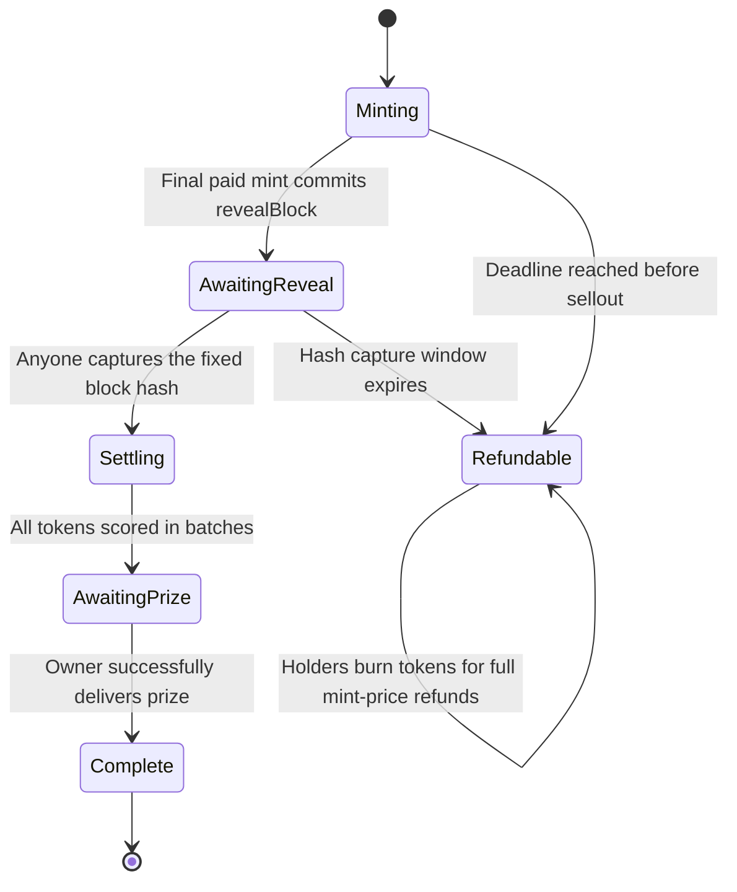

# Versioned contract behavior

**V10 is the local contract, Web, Launch, indexer and worker baseline.** Exact version-aware reads, minting, identity validation, frozen manifests, migration 026, deployment preparation and registry setup tooling are implemented. New drafts target V10 while historical exports and explicit V9 recovery retain their actual version. Live database migration, Eligibility V5 / Winner Credits V6 deployment, hosted rollout and a V10 Sepolia rehearsal remain pending. The completed Sepolia collection remains immutable V8. Start with [architecture.md](architecture.md) and the [V10 rollout handoff](permanent-combinations-v10.md).

## V10 permanent numbers and later results

`ManekinekoRoundV10` (`affiliate-v10`, `unique-rank-v6`) derives a unique ordered four-number identity from each assigned token ID in Solidity. Mint callers supply no numbers or seed. Numbers are fixed and predictable from deployment identity; they do not predict prizes. The immutable renderer returns finished on-chain JSON/SVG from the first mint, without a Score, Award Rank, Prize or changing Status field.

After sellout, one Chainlink VRF request and bounded permissionless finalization select the configured 1–10 distinct winning NFTs, default six, and assign unique scores `1..N`. Top-ranked NFTs receive equal configured prizes. A single wallet may hold several winners. The draw and all claims leave the NFT's metadata unchanged.

| V10 read | Meaning |
| --- | --- |
| `combinationKey()` | Fixed public presentation key; not prize entropy |
| `combination(tokenId)` | Existing NFT's permanent numbers/code; score zero means the draw is pending |
| `tokenIdForCombination(numbers)` | Decodes the permanent identity and verifies that the NFT exists |
| `score(tokenId)` / `scoreCombination(numbers)` | Final score; reverts before draw finalization |
| `tokenURI(tokenId)` | Permanent on-chain JSON/SVG while the NFT exists |
| `revealed`, `phase`, `winningTokenIds`, `prizeClaimed` | Draw, winner and claim state separate from the artwork |

V10 retains V9's cumulative 20 primary mints per recipient across paid, referral and sponsored mint paths, holder-only independent prize claims, qualified equal affiliate pool, lifetime sponsored reward policy, transfer locks and financial reserves. Unsold expiry permits a holder refund that burns the NFT. Sold-out collections cannot discard a delayed VRF draw through a timeout refund. Ready-for-next-collection and every-prize-claimed remain separate states.

V10 requires compatible Eligibility V5 and Winner Credits V6. Their new source does not upgrade the deployed V4/V5 registries. Historical eligibility and already-used lifetime rewards must survive an explicitly verified migration. V10 preparation/deployment commands require an exact V10 export and trusted content hash. Existing V9 exports continue through explicit V9 tooling; they are never converted during execution.

For the selection proof and external dependency boundaries, see [unique combinations and winners](unique-winner.md) and [blockchain randomness](blockchain-randomness.md). For V8/V9's historical sealed-to-revealed artwork and explorer recovery, see [NFT gallery](nft-gallery.md).

## Legacy V1 contract reference

Everything below describes the original `ManekinekoRound` and `ManekinekoFactory` only. Its blockhash source, owner-only payout, 50% prize and single-winner rules are historical. Do not apply its commands or lifecycle to V9/V10. The corresponding [V1 deployment guide](deployment.md) and [V2 deployment guide](deployment-v2.md) remain version-specific records.

`ManekinekoRound` is one finite ERC-721 collection and competition. Every paid token receives a unique ordered combination of four integers, and the contract computes the complete score and winning token. The owner can deliver exactly 50% of primary mint receipts to the current winning token holder, then withdraw the remainder. `ManekinekoFactory` records successive round deployments and requires the previous round to sell out and deliver its prize before creating another.

The implemented default is a **sealed mint followed by reveal after sellout**. Token IDs and ownership exist immediately; the combination and score become available only after a fixed future block hash is captured. Collection metadata and its SVG image are returned entirely from the deployed contract. This repository provides the implementation and local validation; it does not establish a live production deployment.

The contracts pin Solidity `0.8.37+commit.f401782d`, released on September 10, 2026. The official release tag resolves to commit `f401782df49be312ea4ef52a2d467cf5183b5906`. Builds use the pinned local `solc` package, optimizer enabled with 200 runs, and the Cancun EVM target. The official release page initially noted that binary distribution was still in progress; the release and commit were verified independently of npm. [Official Solidity release](https://github.com/argotorg/solidity/releases/tag/v0.8.37), [release commit](https://github.com/argotorg/solidity/commit/f401782df49be312ea4ef52a2d467cf5183b5906).

Every deployment supplies the following `ManekinekoRound.Config` fields. The contract has no constructor defaults and exposes no setters for these rules: configurable means choosing values for each new round, while an existing round's terms remain fixed.

| Field | Enforced contract bounds | Deployment tooling behavior |
| --- | --- | --- |
| `name` | 1–80 bytes | Local fallback and example: `Manekineko Round 1`. |
| `symbol` | 1–16 bytes | Local fallback and example: `NEKO`. |
| `roundId` | Nonzero `uint256` | The factory requires `roundCount + 1`; the first round is 1. The script reads this value from the factory. |
| `maxSupply` | 1–65,536 tokens | Local fallback: 100. Example JSON: 1,000. |
| `mintPrice` | An even integer of at least 2 wei; at most `type(uint256).max / maxSupply` | JSON uses the decimal-string field `mintPriceWei`. Local fallback: `1000000000000000` wei, or 0.001 native coin. Example JSON: `10000000000000000` wei, or 0.01 native coin. |
| `mintDeadline` | A Unix timestamp strictly later than deployment's block timestamp | The script adds JSON `mintDurationSeconds` to the latest block timestamp. Tooling permits 1–31,536,000 seconds; fallback and example use 604,800 seconds, or seven days. The duration limit belongs to the script, not the contract. |
| `revealDelayBlocks` | 2–200 blocks | Local fallback and example: 5. This is a block count, not a duration in seconds. |
| `initialOwner` | A nonzero address | Optional in the script's JSON; defaults to the deployment signer. The factory receives its own initial owner separately. |

The fixed prize share is 5,000 basis points, or 50%. A single mint transaction may mint 1–20 tokens, and a settlement transaction may process 1–200 tokens. Supply, batch limits, prize share, and score formula cannot be changed after deployment. Name and symbol limits count bytes, so a Unicode character may occupy more than one byte.

The script's fallback applies only to local chain ID 31337 when `ROUND_CONFIG_PATH` is absent. Sepolia deployment requires an explicit configuration file. The checked-in `apps/contracts/round.example.json` is an example with different supply and price, not an implicit production default. Numeric JSON fields are unsigned decimal strings. The deployment script currently permits only local development and Sepolia; it does not select or deploy to another chain automatically.



The final mint fixes `revealBlock = block.number + revealDelayBlocks` before calling NFT receivers. All primary sales are complete before the entropy source block exists. `captureReveal()` can succeed only when `block.number > revealBlock` and `block.number <= revealBlock + 256`. For example, a source block of 1,000 can be captured in blocks 1,001–1,256, inclusive. At block 1,257, capture is unavailable and refunds become available. The seed is `keccak256(abi.encode(blockhash(revealBlock), address(this), block.chainid, roundId))` and can be recorded only once. There is no replacement source block, reroll, owner-selected seed, or retry using new entropy. Solidity's native `blockhash` exposes only the most recent 256 previous blocks. [Solidity block variables](https://docs.soliditylang.org/en/latest/units-and-global-variables.html).

Capturing the seed permanently removes the blockhash deadline: later scoring can proceed across any number of bounded transactions. Each `settle(count)` call scans the next consecutive token IDs and records the greatest result so far. `winningTokenId` and `highestScore` remain provisional until `settledCount == maxSupply`. Anyone can finish the scan, but only the round owner can pay the prize. A sold-out round is governed by its reveal window even if its original mint deadline subsequently passes.

The four numbers are derived from an injective 32-bit combination code. Starting with `tokenId - 1`, the contract splits the input into two 16-bit halves and applies four Feistel rounds. For round index `i`, the round function is the low 16 bits of `keccak256(abi.encode(revealSeed, i, right))`. The resulting code is split into four bytes in order from most significant to least significant; adding 1 gives `a`, `b`, `c`, and `d`, each in `[1, 256]`.

```text
combinationCode = ((a - 1) << 24)
                | ((b - 1) << 16)
                | ((c - 1) << 8)
                |  (d - 1)

score = (a * b + c * d) * 4,294,967,296 + combinationCode
```

For a worked arithmetic example, the combination `(2, 3, 4, 5)` encodes as `0x01020304`, or `16,909,060`. Its primary arithmetic result is `2 × 3 + 4 × 5 = 26`, giving the complete score `26 × 4,294,967,296 + 16,909,060 = 111,686,058,756`. This illustrates scoring an already derived combination; it does not predict which token receives that combination in a particular round.

Uniqueness follows from the construction, rather than from assuming hashes never produce the same digits. A Feistel step maps `(L, R)` to `(R, L XOR F(R))` and has the inverse `(L', R') → (R' XOR F(L'), L')`. Every step is therefore bijective, and composing four steps preserves distinct inputs. Different token IDs produce different codes and ordered tuples within a round. The code occupies only the low 32 bits of the score, so different primary results occupy disjoint intervals; equal primary results are resolved by the unique code. Consequently, complete scores do not tie, and all scores fit below `2^50`. Uniqueness is scoped to one collection; combinations may repeat across separate rounds. This proof establishes uniqueness, not independent random draws or equal winning probabilities.

| Round API | Caller | Behavior |
| --- | --- | --- |
| `mint(to, quantity)` | Anyone, payable | Sends exactly `quantity * mintPrice`; assigns sequential token IDs beginning at 1. Rejects zero quantity, oversized batches, excess supply, overpayment, underpayment, and minting at or after the deadline. `to` cannot be zero or the round itself. Contract recipients must accept ERC-721 safe minting. |
| `captureReveal()` | Anyone | Preserves the committed source block hash during its one capture window. Requires sellout and an uncancelled, unrevealed round. |
| `settle(count)` | Anyone | Advances the consecutive scan by at most 200 tokens, clamped to the remaining supply. Requires a revealed round whose scan is unfinished. |
| `distributePrize()` | Round owner | After the complete scan, sends exactly half of historical primary mint receipts to `ownerOf(winningTokenId)`. Succeeds only once. |
| `cancelExpiredRound()` | Anyone | Records cancellation once the unsold deadline or uncaptured reveal window has expired. There is no discretionary early cancellation. |
| `refund(tokenId, recipient)` | Current token holder | Once refunds are available, burns the token and pays exactly its original mint price to the holder-selected recipient. Approved operators cannot redeem. The first refund also records cancellation if needed. |
| `withdraw(recipient, amount)` | Round owner | Sends a positive amount no greater than `withdrawableBalance()`. The recipient cannot be zero or the round itself. |
| `combination(tokenId)` | Anyone, view | Returns the four numbers, combination code, and complete score for an existing token after reveal. Reverts before reveal and for nonexistent or refunded tokens. |
| `tokenURI(tokenId)` | Anyone, view | Returns Base64 JSON containing an embedded Base64 SVG and attributes. Shows sealed or refundable status before reveal, and the combination and score after reveal. |
| `phase()` | Anyone, view | Reports `Minting`, `AwaitingReveal`, `Settling`, `AwaitingPrize`, `Complete`, or `Refundable`, in that enum order. Expiry can change this view before anyone records cancellation. |
| `soldOut()`, `totalSupply()` | Anyone, view | Sellout uses lifetime `totalMinted == maxSupply`; current supply is `totalMinted - refundedCount`. Refunds do not reopen minting. |
| `prizeAmount()` | Anyone, view | Returns `totalMintRevenue / 2`. This is an accounting value; calling it does not establish eligibility for payout. |
| `refundsAvailable()`, `withdrawableBalance()` | Anyone, view | Report current refund eligibility and the maximum native-currency amount the owner may withdraw. |
| `readyForNextRound()` | Anyone, view | Returns true only when the collection sold out and its prize payment succeeded. |

The contract also exposes public configuration and accounting getters, plus standard ERC-721 ownership, approval, and transfer functions. Tokens remain transferable before and after reveal and payment. Direct transfers into the round contract itself are rejected to prevent trapping its own NFTs. Metadata implements ERC-4906 interface reporting and emits `BatchMetadataUpdate` after capture or recorded cancellation. Lifecycle events include `Minted`, `SoldOut`, `Revealed`, `SettlementProgress`, `WinnerDetermined`, `PrizeDelivered`, `RoundCancelled`, `Refunded`, and `Withdrawn`; consumers should combine events with the current state getters.

Money is denominated in the chain's native currency. Only payments accepted by `mint()` contribute to `totalMintRevenue`. Secondary sales, trading fees, donations, and forcibly sent native currency do not increase the prize. Requiring an even mint price makes the 50% split exact in wei for every permitted supply. There is no owner allocation or free mint that bypasses payment.

Until prize payment, all primary receipts remain reserved. During an active round `withdrawableBalance()` is zero, including for surplus donations. Once refunds become available, the outstanding liability is `totalMintRevenue - totalRefunded`; the owner may withdraw only balance above that liability. Each refund pays one original mint price, regardless of what a later buyer paid for the NFT. Refund entitlement belongs to the current holder, including a gift recipient, and transfers with the NFT. Refunding burns the NFT permanently. Ordinary direct native-currency transfers are rejected because the round has no payable receive or fallback function, although force-sent currency remains possible.

Prize entitlement likewise follows the NFT. `distributePrize()` resolves the holder when the function executes, rather than paying the original minter or the owner recorded during scoring. The owner cannot choose another prize recipient or change the amount. Payment state is updated before the external call, and every value-moving game function uses a reentrancy guard. If the recipient rejects payment, the transaction reverts completely: `prizePaid` remains false, funds remain reserved, and the factory cannot roll over. The holder can transfer the winning NFT to an address that accepts native currency and the owner can retry. After a successful payment, transferring the winning token does not create another prize entitlement. All remaining balance then becomes withdrawable by the owner, and the paid recipient and amount remain recorded.

Both contracts use two-step ownership transfer: the existing owner nominates a successor with `transferOwnership`, and that successor calls `acceptOwnership`. Ownership renunciation is disabled. Factory ownership and each round's ownership are separate; transferring the factory does not transfer previously created rounds. There is no upgrade, rule-editing, arbitrary seed-setting, or owner-triggered token-burning API.

| Factory API | Caller | Behavior |
| --- | --- | --- |
| `createRound(config)` | Factory owner | Creates round 1 immediately, or the next consecutive round only when the latest registered round returns `readyForNextRound() == true`. Returns the deployed address and emits `RoundCreated(roundId, round, roundOwner)`. |
| `roundCount()`, `rounds(roundId)` | Anyone, view | Expose the registry's number of created rounds and their addresses. |

**A refundable or cancelled latest round permanently stops this factory's sequence.** Refunding every token does not satisfy the sellout-and-prize gate, and there is no skip, reset, or cancellation rollover function. Starting a new sequence after such a round requires deploying a new factory. Direct deployment of a `ManekinekoRound` is also possible, but does not register it in an existing factory. The strict gate reflects the specified condition that a successor follows a sold-out round whose winner was paid.

All score computation, winner selection, balances, ownership, metadata JSON, and SVG construction live in the deployed contracts. No oracle response, hosted image, IPFS gateway, metadata API, or server callback is required by the game. Vercel hosts optional user interfaces; it does not execute the EVM or become a dependency of the deployed rules. Build and deployment tools necessarily run outside the chain.

Progress still requires transactions. Someone must submit reveal capture before the blockhash expires, submit settlement batches, and pay gas. The round owner must submit prize distribution, and the factory owner must submit the next deployment. A future executor can receive the required ownership and perform those calls, using lifecycle events and readiness getters, but this repository does not implement a persistent autonomous operator. Smart contracts cannot wake themselves up when a condition becomes true.

The fixed future block removes a buyer's ordinary ability to inspect a score before completing the sale, but it does **not** make the outcome manipulation-resistant. Block producers can influence blockhash-derived entropy; sequencer-controlled chains introduce chain-specific ordering and production assumptions. Address and chain-ID mixing do not remove that influence, and increasing the delay does not guarantee fairness. The contract therefore makes no claim of secure lottery randomness or equal odds. Solidity explicitly cautions about blockhash randomness and block-builder influence. [Solidity randomness guidance](https://docs.soliditylang.org/en/latest/security-considerations.html).

Owner control also creates a liveness dependency. After successful seed capture, there is no settlement timeout, holder-triggered prize claim, or refund path for owner inaction. An owner who loses access or withholds `distributePrize()` can leave the prize and owner proceeds locked indefinitely and stop successor deployment. A holder contract that cannot receive the prize or transfer its winning token can also prevent completion. These are explicit limits of the implemented owner-only payout model; refunds cover an unsold deadline or a missed reveal window, not those later failures.
